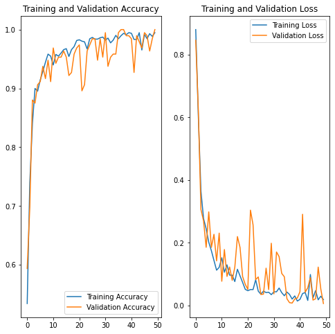

# Agronomic Anomaly Detection

Welcome to Agronomic Anomaly Detection, a sophisticated deep learning project designed to identify and classify 15 different disease classes in agronomic images. Leveraging Convolutional Neural Networks (CNNs) and the powerful VGGNet architecture, this project ensures robust model performance and delivers impressive classification accuracy.

## Key Features

- **Advanced Architecture**: Our project harnesses the power of VGGNet, a state-of-the-art deep learning architecture, to ensure top-notch accuracy and reliability in agronomic anomaly detection.

- **Overfitting Prevention**: We've implemented dropout layers and data augmentation techniques to mitigate overfitting, resulting in a remarkable testing accuracy boost from 62% to an impressive 98.7%.

- **Optimized Efficiency**: Training deep neural networks can be time-consuming. We've incorporated prefetching and caching, reducing training time from 31.40 to just 26.18 minutes for 50 epochs, allowing you to work more efficiently.

- **Visual Insights**: We use Matplotlib for data visualization, enabling you to create informative plots and graphs to gain deeper insights into model performance.

- **Python-Powered**: The entire project is implemented in Python, making it accessible, flexible, and ideal for data scientists and machine learning enthusiasts.

- **Wide Applicability**: While originally designed for agronomic anomaly detection, our model architecture can be adapted to various image classification tasks, opening doors to broader applications.

## Accuracy and Loss graph

Join us in advancing agronomic anomaly detection and image classification using state-of-the-art deep learning techniques. If you have any questions or need assistance, please open an issue on GitHub.
